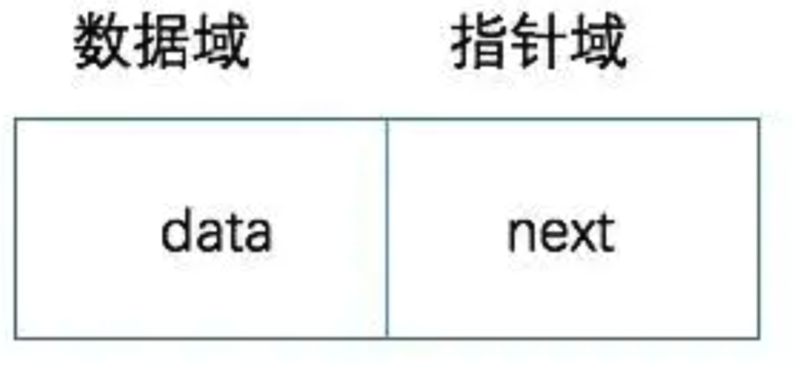
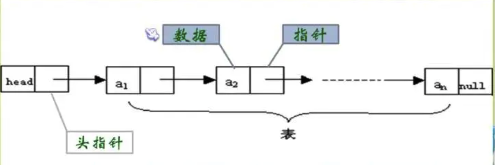
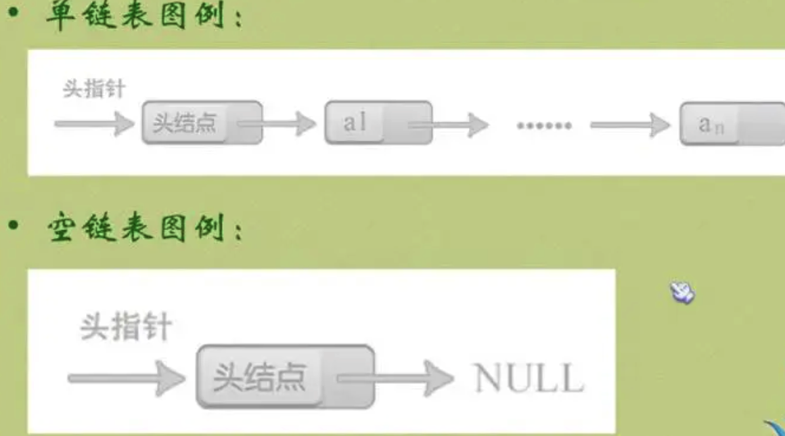

##链表
* 线性表的链式存储结构的特点是用一组任意的存储单元存储线性表中的数据元素，这组存储单元可以存放在内存中未被占用的任意位置。
* 相比顺序存储结构，链式存储结构中，除了需要存储数据元素信息之外，还需要存储它的后继元素的存储地址(指针)。
* 数据域：存储数据元素信息的域，指针域：存储直接后继位置的域。指针域中存储的信息成为指针或链。这两部分信息组成数据元素成为存储映像，成为结点(Node)。
  
* 链式结构：n个结点链接成一个链表，即为线性表(a1,a2,a3,...an)；
* 如果链表的每个结点中只包含一个指针域，那就叫做单链表。

### 1.单链表
* 头指针：链表中的第一个结点的存储位置。
* 线性表中最后一个结点的指针域为空(NULL)。
  

#### 头结点和头指针
头结点：
* 头结点是加在单链表之前附设的一个头结点。
* 头结点的数据域一般不存储任何信息，也可以存放一些关于线性表的长度的附加信息。
* 头结点的指针域存放指向第一个结点的指针(即第一个结点的存储位置)。
* 头结点不一定是链表的必要元素。

头指针：
* 头指针是指链表指向第一个结点的指针，若链表有头结点，则是指向头结点的指针。
* 头指针具有标识作用，所以常用头指针冠以链表的名字(指针变量的名字)。
* 无论链表是否为空，头指针均不为空。
* 头指针是链表的必要元素。

  

#### 2.性能
1. 查找O(n)
2. 插入和删除时间为O(1)

 